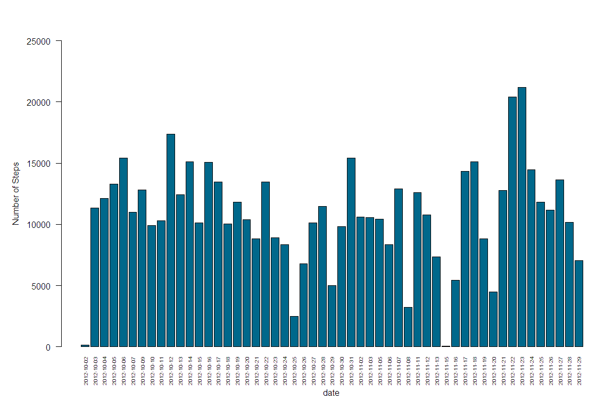
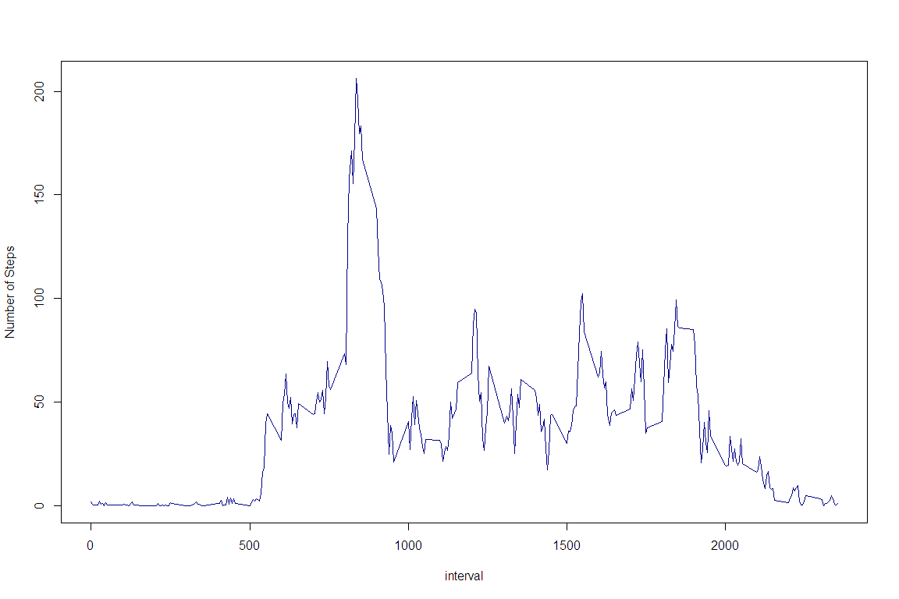
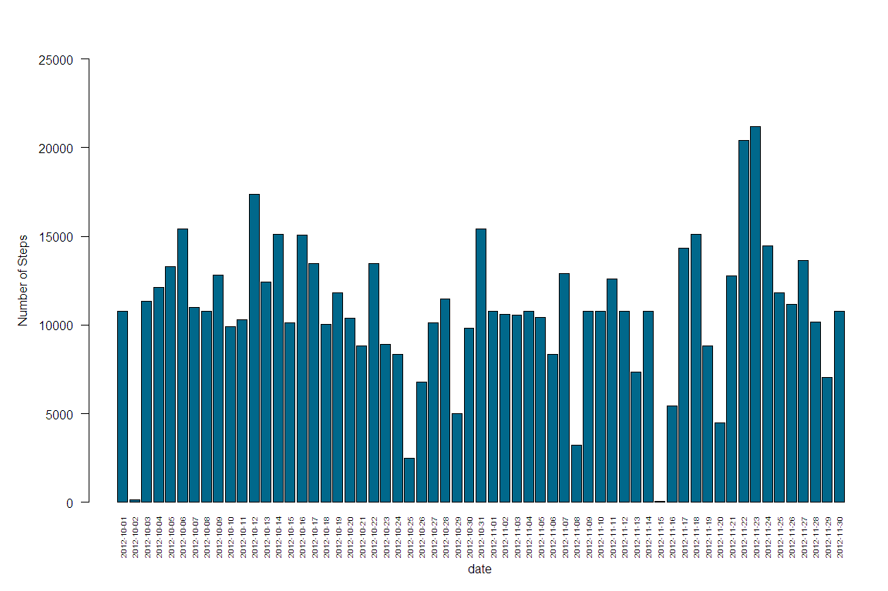
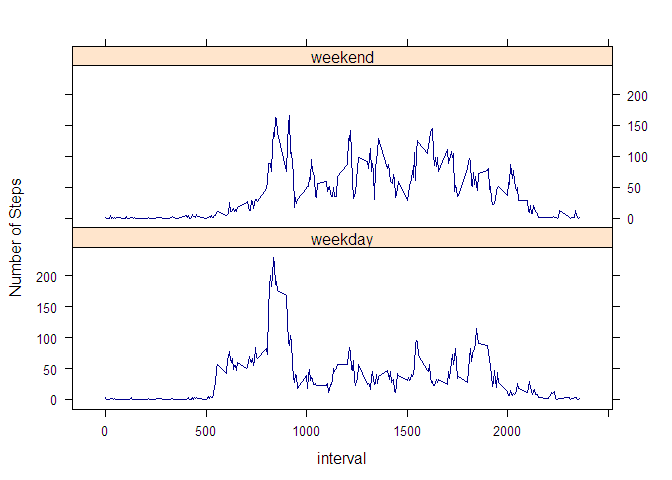

## Loading and preprocessing the data
This assignment will explore and analyze collected data from a personal activity monitoring device. The dataset is first loaded and stored in a dataframe.


```r
url <- 'https://d396qusza40orc.cloudfront.net/repdata%2Fdata%2Factivity.zip'
temp <- tempfile()
download.file(url, temp)
unzip(temp, "activity.csv")
df <- read.csv("activity.csv")
unlink(temp)
str(df)
```

```
## 'data.frame':	17568 obs. of  3 variables:
##  $ steps   : int  NA NA NA NA NA NA NA NA NA NA ...
##  $ date    : Factor w/ 61 levels "2012-10-01","2012-10-02",..: 1 1 1 1 1 1 1 1 1 1 ...
##  $ interval: int  0 5 10 15 20 25 30 35 40 45 ...
```

It can be observed that there are missing values (coded as NA) for the number of steps. Ignoring these, following is a barplot representation of the total number of steps taken each day.


```r
tot_steps1 <- aggregate(steps ~ date, df, sum)
par(mar=c(6,6,4,1), mgp=c(4,1,0), las=2)
barplot(tot_steps1$steps, names.arg = tot_steps1$date, xlab = 'date', 
        ylab = 'Number of Steps', col = 'deepskyblue4', cex.names=0.6,
        ylim = c(0,25000))
```

<!-- -->

## What is the mean total number of steps taken per day?
The mean and median total number of steps taken per day are as follows:


```r
mean(tot_steps1$steps)
```

```
## [1] 10766.19
```

```r
median(tot_steps1$steps)
```

```
## [1] 10765
```

The mean and median are almost equal suggesting that the data is not affected by the prescence of outliers.

## What is the average daily activity pattern?
A closer inspection of the average number of steps taken during each 5-min interval reveals that the highest number of steps are taken during the 835th 5-minute interval.


```r
avg_steps <- aggregate(steps ~ interval, df, mean)
plot(avg_steps$interval, avg_steps$steps, type='l', xlab = 'interval', 
        ylab = 'Number of Steps', col = 'darkblue')
```

<!-- -->

```r
avg_steps[avg_steps$steps == max(avg_steps$steps),]
```

```
##     interval    steps
## 104      835 206.1698
```

## Imputing missing values
Missing values have been ignored up until now but this may introduce bias into some calculations. The total number of missing values is:


```r
sum(is.na(df$steps))
```

```
## [1] 2304
```

These missing values will be imputed by the mean for the corresponding 5-minute interval which have already been calculated for the time-series plot above. Following is the new dataset with missing values filled in:


```r
imputeNA <- df

for (i in 1:nrow(imputeNA)) {
    imputeNA$steps[i] <- ifelse(is.na(imputeNA$steps[i]),
                                avg_steps$steps[avg_steps$interval == imputeNA$interval[i]], df$steps[i])

}

str(imputeNA)
```

```
## 'data.frame':	17568 obs. of  3 variables:
##  $ steps   : num  1.717 0.3396 0.1321 0.1509 0.0755 ...
##  $ date    : Factor w/ 61 levels "2012-10-01","2012-10-02",..: 1 1 1 1 1 1 1 1 1 1 ...
##  $ interval: int  0 5 10 15 20 25 30 35 40 45 ...
```

```r
sum(is.na(imputeNA$steps))
```

```
## [1] 0
```

To study the impact of imputing missing values, the barplot for the total number of steps taken per day is recreated.


```r
tot_steps2 <- aggregate(steps ~ date, imputeNA, sum)
par(mar=c(6,6,4,1), mgp=c(4,1,0), las=2)
barplot(tot_steps2$steps, names.arg = tot_steps2$date, xlab = 'date', 
        ylab = 'Number of Steps', col = 'deepskyblue4', cex.names=0.6,
        ylim = c(0,25000))
```

<!-- -->

The impact is difficult to discern visually so the mean and median for this dataset are recalculated.


```r
mean(tot_steps2$steps)
```

```
## [1] 10766.19
```

```r
median(tot_steps2$steps)
```

```
## [1] 10766.19
```

The mean remains the same and the median negligibly increased but is now equal to the mean indicating symmetrical distribution of data and the abscence of outliers. Imputing missing data introduced 8 additional dates or rows of aggregated data.


```r
nrow(tot_steps2) - nrow(tot_steps1)
```

```
## [1] 8
```

## Are there differences in activity patterns between weekdays and weekends?
The final part of the analysis will explore the average number of steps taken during the 5-minute intervals on weekdays and the weekend. For this purpose, a new factor variable is added to the dataset.


```r
imputeNA['day_type'] <- ifelse(grepl("^S{1}", weekdays(as.Date(imputeNA$date))), 'weekend', 'weekday')

imputeNA$day_type <- as.factor(imputeNA$day_type)
str(imputeNA)
```

```
## 'data.frame':	17568 obs. of  4 variables:
##  $ steps   : num  1.717 0.3396 0.1321 0.1509 0.0755 ...
##  $ date    : Factor w/ 61 levels "2012-10-01","2012-10-02",..: 1 1 1 1 1 1 1 1 1 1 ...
##  $ interval: int  0 5 10 15 20 25 30 35 40 45 ...
##  $ day_type: Factor w/ 2 levels "weekday","weekend": 1 1 1 1 1 1 1 1 1 1 ...
```

The time-series plot of the number of steps taken during each 5-minute interval, averaged across all weekdays or weekend days is then plotted.


```r
library(lattice)
avg_steps <- aggregate(steps ~ interval + day_type, imputeNA, mean)

xyplot(steps~interval|day_type, data=avg_steps, type='l',
       xlab = 'interval', ylab = 'Number of Steps', col = 'darkblue',
       layout=c(1,2))
```

<!-- -->

```r
weekday <- avg_steps[factor(avg_steps$day_type) == 'weekday',]
weekend <- avg_steps[factor(avg_steps$day_type) == 'weekend',]
weekday[weekday$steps == max(weekday$steps),]
```

```
##     interval day_type    steps
## 104      835  weekday 230.3782
```

```r
weekend[weekend$steps == max(weekend$steps),]
```

```
##     interval day_type    steps
## 400      915  weekend 166.6392
```

The highest number of steps are taken during the 835th 5-minute interval on weekdays and the 915th 5-minute interval on weekend days.
